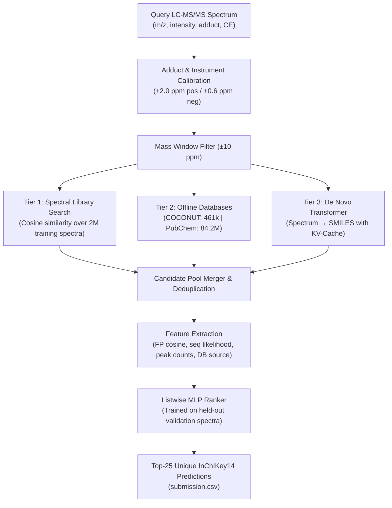

# Enveda CASMI 2026 — Molecule ID From Mass Spectra

[](https://www.kaggle.com/competitions/enveda-CASMI26-molecule-id-mass-spectra)
[-green)](https://www.kaggle.com/competitions/enveda-CASMI26-molecule-id-mass-spectra/leaderboard)
[]()
[-orange)]()
[]()

Predict 2D chemical structures (SMILES) of small molecules and natural products directly from tandem mass spectra (LC-MS/MS). Built for the **Critical Assessment of Small Molecule Identification (CASMI) 2026** challenge.

---

##  Pipeline Architecture

For every query spectrum, the pipeline calculates the adduct-aware neutral mass ($\pm 10\text{ ppm}$, calibrated for timsTOF instrument bias) and merges candidates across three complementary tiers:



### Key Components

1. **Adduct Arithmetic & Instrument Calibration ([`casmi/common.py`](casmi/common.py))**:
   - Accurately derives neutral mass for all 10 competition adducts (`[M+H]+`, `[M+Na]+`, `[M-H]-`, etc.).
   - Corrects for systematic timsTOF spectrometer bias (+2.0 ppm in positive mode, +0.6 ppm in negative mode).

2. **Spectral Library Search ([`casmi/libsearch.py`](casmi/libsearch.py))**:
   - Searches 2.04 million reference spectra in `train.parquet`.
   - Delivers **~0.90–0.95 MRR** when the compound or an isomer has public reference spectra (Class 1).

3. **Offline Candidate Retrieval ([`casmi/candidates.py`](casmi/candidates.py))**:
   - **COCONUT Database**: 461,646 natural product structures.
   - **PubChem Database**: 84,259,636 filtered, neutral, single-component small molecules.
   - Sub-15ms queries via binary-searched Parquet row-group statistics without loading full tables into RAM.

4. **Spectrum-to-Structure Transformer ([`casmi/model.py`](casmi/model.py), [`casmi/train_v2.py`](casmi/train_v2.py))**:
   - **SpectrumEncoder**: Sinusoidal m/z embeddings + peak MLPs + precursor/adduct conditioning token.
   - **Morgan Fingerprint Head**: 4096-bit predicted fingerprint for ranking database candidates.
   - **SmilesDecoder**: Causal autoregressive decoder with KV-cache for candidate log-likelihood and de novo generation.
   - **V2 Generalization Fixes**:
     - 4 randomized SMILES variants per structure to eliminate string memorization.
     - 25% batch mix of structure-only COCONUT examples to learn natural product chemistry from mass alone.
     - Balanced sampling capping spectra per structure to at most 6 per epoch.
     - Dropout 0.2 with 74-token vocabulary.

5. **Candidate Re-Ranker ([`casmi/ranker_lab.py`](casmi/ranker_lab.py), [`casmi/pipeline.py`](casmi/pipeline.py))**:
   - Listwise neural ranker trained with L-BFGS to order candidates from all three tiers.
   - Deduplicates candidates by tautomer-canonical InChIKey first block (InChIKey14).

---

## 📂 Repository Structure

```text
CASMI/
├── README.md                      # Project documentation and quickstart
├── sample_submission.csv          # Competition submission format template
├── test.parquet                   # Test spectra (400 evaluation molecules)
├── train.parquet                  # Training spectra (2.04M spectra, 275k structures)
│
├── casmi/                         # Core Python package (runs locally & on Kaggle)
│   ├── common.py                  # Adduct arithmetic, metric keys, tokenizers, Morgan FPs
│   ├── metric.py                  # MRR@25 replica matching Kaggle evaluation
│   ├── candidates.py              # CandidateDB fast mass-window Parquet query engine
│   ├── libsearch.py               # Spectral library search over train.parquet
│   ├── model.py                   # Transformer architecture (Encoder + FP Head + Decoder)
│   ├── infer.py                   # ModelScorer: fingerprints, candidate scoring, de novo sampling
│   ├── pipeline.py                # End-to-end candidate merging, feature extraction, ranking
│   ├── train.py                   # V1 model training loop
│   ├── train_v2.py                # V2 model training loop (randomized SMILES + COCONUT pretrain)
│   ├── dump_features.py           # Dumps candidate feature tables for offline ranker training
│   ├── ranker_lab.py              # Cross-validated ranker training (L-BFGS listwise loss)
│   └── run_test.py                # Pipeline execution entrypoint (generates submission.csv)
│
├── docs/                          # Detailed guides and background documentation
│   ├── PROGRESS.md                # Progress log, resume guide, and experimental findings
│   ├── Enveda_CASMI_2026_*.md     # Kaggle competition overview and dataset specifications
│   └── CASMI_denovo_tutorial_*.md # Initial tutorial references and notes
│
├── notebooks/                     # Jupyter notebooks
│   ├── casmi_v3_kaggle.ipynb      # Standalone V3 notebook (PubChem 350, 128 samples, 1079-mol MLP)
│   ├── casmi_v2_kaggle.ipynb      # V2 Kaggle submission notebook (PubChem 150, 64 samples)
│   ├── casmi_v1_kaggle.ipynb      # Baseline V1 Kaggle submission notebook
│   └── casmi-denovo-tutorial-*.ipynb # Initial exploratory baseline notebook
│
├── kaggle_assets/                 # Files packaged for Kaggle private dataset
│   ├── model.pt                   # Transformer weights
│   ├── vocab.json                 # SMILES token vocabulary
│   ├── ranker.json                # Fitted candidate ranker weights & scalers
│   ├── structures.parquet         # Training structures and InChIKey index
│   ├── coconut.parquet            # 461k COCONUT candidates
│   ├── pubchem.parquet            # 84.2M PubChem candidates
│   └── rdkit-*.whl                # Offline RDKit wheel for Kaggle runtime
│
├── scripts/                       # Automation and utility scripts
│   ├── build_kaggle_notebook.py   # Assembles self-contained notebook from casmi/ modules
│   ├── package_assets.py          # Packages kaggle_assets/ and rebuilds notebook
│   ├── build_pubchem_hf.py        # Streams PubChem dump, filters, and generates Parquet DB
│   └── legacy/                    # Previous prototype scripts (casmi_v1.py, etc.)
│
├── work/                          # Training outputs, checkpoints, and offline DBs (ignored)
│   ├── ckpt/                      # Model checkpoints (model_v2_best.pt, model_ep*.pt)
│   ├── db/                        # Generated Parquet DBs (coconut.parquet, pubchem.parquet)
│   └── v2/                        # V2 tokenized datasets and vocabulary
│
└── output/                        # Local submission predictions
    └── submission.csv             # Verified 400-molecule test prediction
```

---

## 🚀 Quickstart & Usage

### 1. Environments
* **GPU Training**: `~/casmi-gpu-venv/bin/python` (PyTorch 2.10 + CUDA, bf16 enabled, RDKit).
* **CPU / Analysis**: `~/miniconda3/envs/casmi/bin/python` (RDKit, pandas, pyarrow, scikit-learn).

### 2. Train V2 Model
To train the generalized spectrum-to-structure model on the RTX 4090:
```bash
~/casmi-gpu-venv/bin/python -m casmi.train_v2 --epochs 8 --batch-size 256
```

### 3. Generate Local Submission
Run inference on `test.parquet`:
```bash
~/miniconda3/envs/casmi/bin/python -m casmi.run_test \
    --test test.parquet \
    --train train.parquet \
    --assets kaggle_assets \
    --out output/submission.csv
```

### 4. Package Assets & Rebuild Kaggle Notebook
```bash
~/miniconda3/envs/casmi/bin/python scripts/package_assets.py --model work/ckpt/model_v2_best.pt
```

### 5. Submit to Kaggle
1. Upload/update `kaggle_assets/` in your private Kaggle dataset (`casmi-v1-assets`). *(For V3, only `ranker.json` needs to be updated).*
2. Import [**`notebooks/casmi_v3_kaggle.ipynb`**](notebooks/casmi_v3_kaggle.ipynb) into a new Kaggle notebook (e.g. `casmi-v3-notebook`).
3. Attach the competition data and your `casmi-v1-assets` dataset.
4. Select **GPU T4**, toggle **Internet Off**, and click **Save Version → Save & Run All (Commit)**.
5. In the Output tab, click **Submit to Competition**.

---

## 📊 Competition Submissions & Scoreboard

| Version | Key Innovations | Offline Validation (c1 / c2 / c3 MRR) | Kaggle Public LB (MRR@25) | Status |
|:---:|:---|:---:|:---:|:---:|
| **V1** | 3-tier retrieval (Library + COCONUT 461k + De Novo Transformer); baseline linear ranker on 125 natural products | 0.900 / 0.225 / 0.059 | **0.207** | Succeeded |
| **V2** | + 84.2M PubChem Parquet database (±10 ppm); V2 Transformer (4 randomized SMILES variants + 25% COCONUT pretrain); MLP Ranker | 0.924 / 0.225 / 0.062 | **0.241** *(+16.4%)* | New Personal Best 🏆 |
| **V3** | Expanded PubChem shortlist (150→**350**); doubled de novo sampling (64→**128**); 5-Fold MLP-32 Ranker fitted on **all 1,079 molecules** (val_np + val_rand) | **0.864 / 0.522 / 0.132** *(+132% c2 gain!)* | `______` *(Awaiting V3 LB Result)* | Ready for Submission 🚀 |

### Cross-Validation Comparison on 1,079 Molecules (V3 Ranker)

| Ranker Design | val_np c1 | val_np c2 | val_np c3 | val_rand c1 | val_rand c2 | val_rand c3 |
|---|:---:|:---:|:---:|:---:|:---:|:---:|
| **Fallback Hand-Weights** | 0.924 | 0.225 | 0.059 | 0.695 | 0.198 | 0.106 |
| **Linear + Lib-Confidence** | 0.815 | 0.485 | 0.101 | 0.720 | 0.259 | 0.136 |
| **MLP-16 + Lib-Confidence** | 0.866 | 0.558 | 0.146 | 0.728 | 0.311 | 0.154 |
| **MLP-32 + Lib-Confidence (V3)** | **0.864** | **0.522** | **0.132** | **0.734** | **0.309** | **0.161** |

